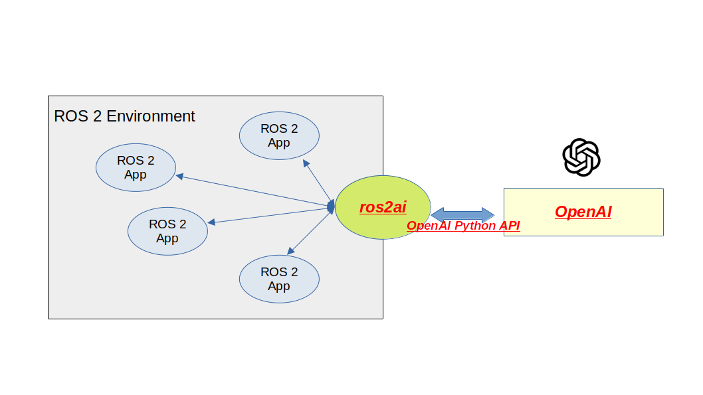

[](https://github.com/fujitatomoya/ros2ai/actions/workflows/humble.yml) [](https://github.com/fujitatomoya/ros2ai/actions/workflows/iron.yml) [](https://github.com/fujitatomoya/ros2ai/actions/workflows/jazzy.yml) [](https://github.com/fujitatomoya/ros2ai/actions/workflows/rolling.yml)

# ros2ai 🤖

[ros2ai](https://github.com/fujitatomoya/ros2ai) is a <span style="color:red">next-generation</span> [ROS 2](https://github.com/ros2) command line interface extension with [OpenAI](https://openai.com/) and [Ollama](https://github.com/ollama/ollama).

see [overview slide deck](https://raw.githack.com/fujitatomoya/ros2ai/rolling/doc/overview.html) for more information.



## Motivation

- (Just for fun 😝)
- Getting answers against the questions directly without browsing, clicking and typing many times.
- Easy to use for everyone, especially for [ROS 2](https://github.com/ros2) beginners and students who do not really know [ros2cli](https://github.com/ros2/ros2cli).
- Multiple language support.
- Multiple LLMs support (with [OpenAI Python API](https://github.com/openai/openai-python))

## Demo 🖥️

See how it works 🔥

https://github.com/fujitatomoya/ros2ai/assets/43395114/78a0799b-40e3-4dc8-99cb-488994e94769

## Supported [ROS Distribution](https://docs.ros.org/en/rolling/Releases.html)

| Distribution      | Supported | Note |
| :---------------- | :-------- | :--- |
| Rolling Ridley    |    ✅     | Development / Mainstream Branch |
| Jazzy Jalisco     |    ✅     | |
| Iron Irwini       |    ✅     | |
| Humble Hawksbill  |    ✅     | |

## Installation

### Docker Container

see available images for [tomoyafujita/ros2ai@dockerhub](https://hub.docker.com/repository/docker/tomoyafujita/ros2ai/tags?page=1&ordering=last_updated)

```bash
docker run -it --rm --net=host -e OPENAI_API_KEY=$OPENAI_API_KEY tomoyafujita/ros2ai:humble
```

> [!NOTE]
> `OPENAI_API_KEY` environmental variable is not required if using Ollama. And it is expecting that Ollama runs on the host system mostly, so that container is bound to the host network interface.

https://github.com/fujitatomoya/ros2ai/assets/43395114/2af4fd44-2ccf-472c-9153-c3c19987dc96

### Required Package

- `rolling` / `jazzy`

  ```bash
  pip install openai ollama validators --break-system-packages --ignore-installed
  ```

  > [!NOTE]
  > see [PEP 668 – Marking Python base environments as “externally managed”](PEP 668 – Marking Python base environments as “externally managed”) why `--break-system-packages` is required.

- `iron` / `humble`

  ```bash
  pip install openai ollama validators --ignore-installed
  ```

### Build

No released package is available, needs to be build in colcon workspace.

```bash
source /opt/ros/rolling/setup.bash
mkdir -p colcon_ws/src
cd colcon_ws/src
git clone https://github.com/fujitatomoya/ros2ai.git
cd ..
colcon build --symlink-install --packages-select ros2ai
```

## Usage

### Prerequisites

As described in overview diagram, `ros2ai` uses only OpenAI Python API but backend implementation can be replaced with Ollama that provides the compatible API with OpenAI.
User need to choose either of them is used by `ros2ai` as following configuration, otherwise it falls back to use OpenAI.

- [OpenAI](https://openai.com/)

  `ros2ai` requires [OpenAI API key](https://platform.openai.com/docs/overview)

  ```bash
  export OPENAI_API_KEY='your-api-key-here'
  ```

  > [!CAUTION]
  > Do not share or expose your OpenAI API key.

- [Ollama](https://github.com/ollama/ollama)

  `ros2ai` requires [Ollama](https://github.com/ollama/ollama) service running, see more details for [How to install Ollama to Linux](https://github.com/ollama/ollama/blob/main/docs/linux.md)

  ```bash
  ### Install Ollama and System Service
  sudo curl -fsSL https://ollama.com/install.sh | sh
  ### Check ollama.service is up and running
  systemctl status ollama
  ### Pull llama3.1 (for example) model
  ollama pull llama3.1
  ### List available models
  ollama list
  ```

#### Optional

| environmental variable | default                     | Note                   |
| :----------------------| :-------------------------- | :--------------------- |
| OPENAI_API_KEY         | None.                       | Required for OpenAI    |
| OPENAI_MODEL_NAME      | 'gpt-4o'                    | AI model to be used. e.g) llama3.1 (Ollama) |
| OPENAI_ENDPOINT        | 'https://api.openai.com/v1' | API endpoint URL. e.g) http://127.0.0.1:11434/v1 (Ollama) |
| OPENAI_TEMPERATURE     | 0.5                         | [OpenAI temperature](https://platform.openai.com/docs/guides/text-generation/how-should-i-set-the-temperature-parameter) |

> [!NOTE]
> These are optional environmental variables. if not set, default value will be used.

### Examples

#### Basics

- configuration

  ```bash
  ### OpenAI configuration
  export OPENAI_API_KEY=<YOUR_API_KEY>
  export OPENAI_MODEL_NAME=gpt-4
  export OPENAI_ENDPOINT=https://api.openai.com/v1

  ### Ollama
  unset OPENAI_API_KEY
  export OPENAI_MODEL_NAME=llama3.1
  export OPENAI_ENDPOINT=http://127.0.0.1:11434/v1
  ```

- `status` to check OpenAI API key is valid.

  ```bash
  root@tomoyafujita:~/docker_ws/ros2_colcon# ros2 ai status -v
  ----- api_model: gpt-4
  ----- api_endpoint: https://api.openai.com/v1
  ----- api_token: None
  As an artificial intelligence, I do not have a physical presence, so I can't be "in service" in the traditional sense. But I am available to assist you 24/7.
  [SUCCESS] Valid OpenAI API key.
  ```

- `query` to ask any questions to ROS 2 assistant.

  ```bash
  root@tomoyafujita:~/docker_ws/ros2_colcon# ros2 ai query "Tell me how to check the available topics?"
  To check the available topics in ROS 2, you can use the following command in the terminal:

  ---
  ros2 topic list
  ---

  After you enter this command, a list of all currently active topics in your ROS2 system will be displayed. This list includes all topics that nodes in your system are currently publishing to or subscribing from.
  ```

- `exec` that ROS 2 assistant can execute the appropriate command based on your request.

  ```bash
  root@tomoyafujita:~/docker_ws/ros2_colcon# ros2 ai exec "give me all nodes"
  /talker
  root@tomoyafujita:~/docker_ws/ros2_colcon# ros2 ai exec "what topics available"
  /chatter
  /parameter_events
  /rosout
  root@tomoyafujita:~/docker_ws/ros2_colcon# ros2 ai exec "give me detailed info for topic /chatter"
  Type: std_msgs/msg/String
  Publisher count: 1
  Subscription count: 0
  ```

#### Multiple Language

- Japanese (could be any language ❓)

  ```bash
  root@tomoyafujita:~/docker_ws/ros2_colcon# ros2 ai query "パラメータのリスト取得方法を教えて"
  ROS 2のパラメータリストを取得するには、コマンドラインインターフェース(CLI)を使います。具体的には、次のコマンドを使用します：

  ---code
  ros2 param list
  ---

  このコマンドは、現在動作しているすべてのノードのパラメーターをリストアップします。特定のノードのパラメータだけを見たい場合には、以下のようにノード名を指定することもできます。

  ---code
  ros2 param list /node_name
  ---

  このようにして、ROS2のパラメータリストの取得を行うことが可能です。なお、上述したコマンドはシェルから直接実行してください。
  ```

## Reference

[](https://www.youtube.com/watch?v=60IOU1KrWXY)

- [ROSCon 2024 Presentation Slide](https://raw.githack.com/fujitatomoya/ros2ai/rolling/doc/ROSCon2024_ros2ai.html)
- [OpenAI API documentation](https://platform.openai.com/docs)
- [OpenAI Python API](https://github.com/openai/openai-python)
- [Ollama](https://github.com/ollama/ollama)
- [Ollama Python API](https://github.com/ollama/ollama-python)

Special thanks to [OpenAI API](https://platform.openai.com/) and [Ollama](https://github.com/ollama/ollama) 🌟🌟🌟
